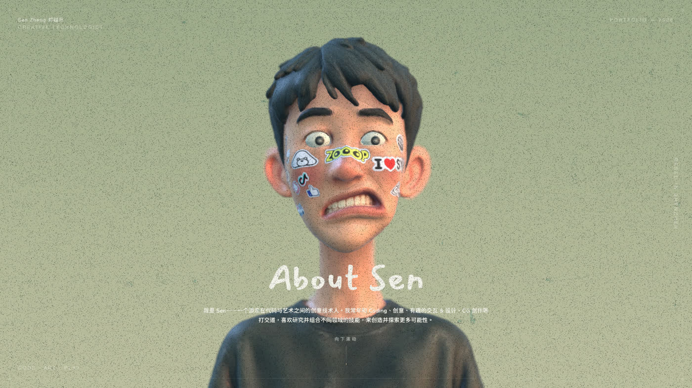

<h1 align="center">3D Resume · Wang Ze</h1>

<p align="center">
  <a href="LICENSE"></a>
  
  
  
  
  <a href="https://about.senbuzy.com/"></a>
</p>

<p align="center"><b>Scrolling is the camera move. Your résumé, living inside a 3D scene.</b></p>

<p align="center">
  <a href="https://about.senbuzy.com/">Live Demo</a> |
  <a href="#quick-start">Quick Start</a> |
  <a href="#make-it-yours">Make It Yours</a> |
  <a href="#swapping-the-character-model">Swap the Model</a> |
  <a href="#tutorials">Tutorials</a> |
  <a href="#deploy">Deploy</a> |
  <a href="#source-vs-no-code">Source vs No-Code</a> |
  <a href="README.md">简体中文</a>
</p>

<p align="center">
  <a href="https://about.senbuzy.com/"></a>
</p>

A scroll-driven personal 3D résumé built on **React Three Fiber + TypeScript**: one fixed 3D background (a character model that reacts to scroll) plus scrollable HTML content in front (About → résumé → works). The camera path is the animation baked into the glb — the scrollbar just wipes through its timeline — with auto-focus depth-of-field and eye-follows-cursor layered on top. It's a pure front-end SPA: `npm run build` gives you a static `dist/` that runs anywhere.

> **Open-source terms (read this first)**
> The **code** is under the **MIT** license (see [`LICENSE`](LICENSE)) — you're welcome to study, reuse, and build on it.
> The **personal content and assets** (name / character model / résumé / works copy / brand logos / social links) are **not covered by MIT** and remain the author's copyright — replace them with your own after forking, see [`NOTICE`](NOTICE).

## Quick Start

### Without writing code

Try [intro3d.com](https://intro3d.com): a no-code DIY platform for 3D personal homepages, beginner-friendly, that handles building and deployment in one place. It lacks this project's eye-follows-cursor interaction but is otherwise fairly complete. If you want a similar 3D résumé fast, it's the quicker route; see [Source vs No-Code](#source-vs-no-code) for the trade-offs.

Even on the source route, intro3d doubles as a **visual glb exporter**: skip Blender, arrange the model and camera in the browser, and export the `me.glb` this project needs — see the [intro3d model tutorial](tutor/intro3d处理模型教程/intro3d处理模型教程.md) (in Chinese).

### Running it locally

The whole front-end app lives under [`web/`](web). **Every code / asset path below is relative to `web/`** (e.g. `src/App.tsx` means `web/src/App.tsx`), and npm commands run inside `web/`.

```bash
git clone https://github.com/dayinji/3d-resume.git
cd 3d-resume/web
npm install
npm run dev        # dev at http://localhost:5173
```

The rest of the commands:

```bash
npm run build      # type-check + bundle, output to dist/
npm run preview    # preview the build output
npm run typecheck  # type-check only (tsc -b)
npm run lint       # ESLint
```

**Requirements:** Node.js 20+ (ESLint 10 needs it). No backend, no database, no API keys.

## What You Get

- An online résumé that films itself: scroll to an entry and the camera pushes to its anchor
- Your own character model (export a glb from Blender or intro3d)
- A works gallery with markdown-authored detail pages
- Eye-follows-cursor, auto-focus depth-of-field, Bloom, film grain — a full mood pass
- Free hosting: GitHub Pages / Cloudflare Pages / any static host
- Deployable to any subdirectory (`base: './'`, fully relative output)

## Make It Yours

Content and presentation are separated; changing content mostly means editing data files:

| What you want to change | Where |
| --- | --- |
| Hero About copy | `COPY` in `src/App.tsx` |
| Résumé (education / experience / clients / social links) | `src/ui/Resume.tsx` |
| Works sections and work list | `src/data/works.ts` |
| A single work's detail body | `src/content/works/<slug>.md` (frontmatter + markdown; format in `src/data/workDocs.ts`, example in `src/content/works/example.md`) |
| Number of résumé entries / camera stops | `FOCUS_POINTS` in `src/data/focusPoints.ts` (keep it in sync with `Resume.tsx`'s entries) |
| Lights / DoF / Bloom / background gradient / character position | **Plain constants** at the top of each component in `src/scene/Scene.tsx` — edit the values directly, no panel and no extra config file |
| The character model | `public/models/me.glb`, see [Swapping the character model](#swapping-the-character-model) |

Work details use minimal markdown: one `.md` per work, linked via the `slug` on each item in `works.ts`; a work with no matching `.md` falls back to the shared placeholder detail.

## Assets & Media

- **Work details are placeholders by default.** The open-source version ships without the author's work details or media: the gallery keeps each section / work **title**, and opening a detail shows a shared placeholder (change `detailPlaceholder / phImageLabel / phButtonLabel` in `works.ts`). To fill one in, write a `src/content/works/<slug>.md` and it renders as a full detail.
- **`public/works/` is not tracked by git by default** (large and personal, see `.gitignore`) — only the 4 section covers `public/works/covers/*.jpg` are kept; place other media yourself or serve it from a CDN, referenced with `/works/...` absolute paths.
- Assets in `public/models/`, `public/images/`, `public/textures/`, `public/fonts/` are tracked. Among them the character model, brand logos, and images are personal content (see [`NOTICE`](NOTICE)); fonts / HDR are third-party — check their licenses before reuse.
- `scripts/compress-media.sh` uses ffmpeg to compress images / videos under `public` in place (max width 1920, H.264 video ~2Mbps), overwriting only when the result is smaller.

## Swapping the Character Model

To use your own character, replace `public/models/me.glb` (its source is [`blender/sen.blend`](blender) at the repo root — edit it in Blender and export a glb over it), or rewrite `src/scene/Scene.tsx` with your own scene. The code looks these up in the glb **by object name**; whatever is missing, that feature breaks:

| The glb needs | What it does | If it's missing |
| --- | --- | --- |
| A camera + an animation clip named `CameraAction` | The scroll-driven camera path; its total frame count is read at runtime (24fps), not hardcoded | No camera motion — the whole effect is gone |
| `focus-start` (or `focus-0`) | The hero's starting focus anchor (an empty); both names accepted | Hero auto-focus stops working |
| The timeline focus anchors (one empty per résumé entry) | Listed in order in `FOCUS_POINTS` (`src/data/focusPoints.ts`) — the single source of truth shared by `Scene.tsx` and `Resume.tsx`. The count is **dynamic** | That node never pulls focus |
| `focus-works` | The works-section focus anchor (an empty); optional | Falls back to the last timeline anchor |
| A mesh whose name contains `eye` | The eyes (eye-follows-cursor) | The eyes stay still |

## How It Works

A pure front-end SPA, no backend and no router: `index.html` → `src/main.tsx` → `src/App.tsx` (one fixed `<Canvas>` 3D background + a scrollable HTML overlay).

- **3D background**: `src/scene/Scene.tsx` loads `public/models/me.glb` and, using the glb's own camera animation, wipes through it in 5 scroll-driven segments, layering auto-focus depth-of-field and eye-follows-cursor on top. Lighting comes from `src/scene/Env.tsx` (`public/textures/env.hdr` as IBL).
- **Scroll content**: `Hero` (About, inside `App.tsx`) → `src/ui/Resume.tsx` (résumé timeline) → `src/ui/Works.tsx` (works gallery + detail modal).
- **Overlays**: `LoadingScreen` (masks the screen until the model loads), `NoiseOverlay` (film grain), scroll-darken / frosted right rail / hero decorative frame (all in `App.tsx`).
- **Post-processing**: the `<EffectComposer>` order is DepthOfField → Bloom → SMAA; mind the order when changing effects, it affects compositing.
- **Global state**: `src/store.ts` (zustand, lightweight).

The camera lines up with the résumé through `CameraAction`'s **frame convention** (24fps):

```
frame 0                                                          last frame
  │        │        │        │        │        │                    │
focus-0  focus-1  focus-2  focus-3  focus-4  focus-5  ···  ···  focus-works
hero    ├─50 fr.─┤ timeline nodes sit 50 frames apart      tail = works (any length)
```

```ts
// src/data/focusPoints.ts — the single source of truth for entries / camera stops
export const FOCUS_POINTS = ['focus-1', 'focus-2', 'focus-3', 'focus-4', 'focus-5'] as const
export const FRAMES_PER_NODE = 50
```

To add or remove a résumé entry, change `FOCUS_POINTS` + `Resume.tsx`'s entries; the node count and frame ranges are derived automatically.

## Repo Layout

| Directory | Contents |
| --- | --- |
| [`web/`](web) | The front-end app (React Three Fiber + TypeScript); every code convention lives here |
| [`blender/`](blender) | The 3D scene source `sen.blend` (character + camera animation + focus anchors) — what you edit before exporting the glb |
| [`tutor/`](tutor) | Fork-it-yourself tutorials (deploy, stickers, eyes, intro3d model export) |
| [`docs/`](docs) | The preview image used by this README |
| [`CLAUDE.md`](CLAUDE.md) [`AGENTS.md`](AGENTS.md) | Conventions for AI coding assistants |
| [`LICENSE`](LICENSE) [`NOTICE`](NOTICE) | License & content notice |

Inside `web/`:

```
web/
  src/
    App.tsx              Canvas + scroll-content assembly, hero About, loading/overlays
    main.tsx             entry
    store.ts             global interaction state (zustand)
    data/
      works.ts           works sections / work list (the works data source)
      workDocs.ts        build-time inlining of content/works/*.md + frontmatter parsing
      focusPoints.ts     timeline focus-anchor list (source of truth for entry count)
    content/works/       work-detail markdown; includes an example.md template
    scene/
      Scene.tsx          3D scene: me.glb character + glb camera animation + scroll / eye-follow
      Env.tsx            env.hdr environment lighting (IBL)
    ui/
      Resume.tsx         résumé timeline (holds personal data)
      Works.tsx          works gallery + detail modal
      LoadingScreen.tsx / NoiseOverlay.tsx / SocialIcons.tsx / ZooopLogo.tsx
  public/
    models/  fonts/  images/  textures/   static assets
  scripts/compress-media.sh                media compression script (ffmpeg, in place)
```

## Tutorials

Step-by-step guides written for users (who may not code), all under [`tutor/`](tutor). **They're currently written in Chinese.**

| Tutorial | What it covers |
| --- | --- |
| [① Deploy to GitHub Pages](tutor/部署教程/1-部署到-GitHub-Pages.md) | Publish for free at `your-name.github.io/3d-resume/`, all point-and-click |
| [② Deploy to Cloudflare Pages](tutor/部署教程/2-部署到-Cloudflare-Pages.md) | Free for private repos too, global CDN, easier custom domains |
| [Prep your model in intro3d](tutor/intro3d处理模型教程/intro3d处理模型教程.md) | Skip Blender — arrange model and camera in the browser and export `me.glb` (with video) |
| [Eye-follows-cursor](tutor/眼球教程/眼球教程.md) | How the eyes track the mouse, and how to wire it up for your own model (with video) |
| [AI sticker packs](tutor/贴纸教程/贴纸教程.md) | Batch-generate transparent stickers with AI for the face / scene / web |

## Deploy

```bash
cd web
npm run build    # → dist/
```

`vite.config.ts` sets `base: './'`, so output uses relative paths — `dist/` opens by double-click and can live in any subdirectory (e.g. `example.com/portfolio/`). At runtime public assets are joined with `import.meta.env.BASE_URL`. Deploying is just uploading `dist/` to any static host (GitHub Pages / Cloudflare Pages / Netlify / Vercel / object storage / your own server). The repo ships [`.github/workflows/deploy.yml`](.github/workflows/deploy.yml), so pushing to `main` publishes to GitHub Pages automatically.

## Source vs No-Code

This project and [intro3d.com](https://intro3d.com) are two ends of the same idea. To get online fast, start with intro3d; for full control and deep customization, use this source (they also combine well: export the glb from intro3d, then customize in code).

|  | **This project (source)** | **intro3d (no-code)** |
| --- | --- | --- |
| Getting started | Needs some front-end / CLI comfort | Click around in a browser, beginner-friendly |
| Customization | Everything — scene, post-processing, interactions, structure | Whatever the platform exposes |
| Eye-follows-cursor | ✅ | ❌ |
| 3D model | Make it in Blender or export from intro3d | Handled visually in the platform |
| Deployment | Upload `dist/` to any static host yourself | Hosted for you |
| License | Code MIT (personal content excluded, see `NOTICE`) | Platform terms of service |

## Why This Project?

- **Scroll is the camera move:** the camera path is animation baked into the glb, and the scrollbar just wipes its timeline — easier to tune and swap than hand-written camera interpolation.
- **Data-driven:** changing content means editing data files (`Resume.tsx` / `works.ts` / `*.md` / `COPY`), never the 3D code.
- **Dynamic node count:** the number of résumé entries isn't hardcoded — add one to `FOCUS_POINTS` and nodes plus frame ranges adapt.
- **Parameters are just constants:** every tunable is a plain constant at the top of a component; there is no hidden config layer.
- **Fully static:** no backend, no router, no API keys — `dist/` runs anywhere, including inside a subdirectory.
- **Agent-friendly:** [`CLAUDE.md`](CLAUDE.md) / [`AGENTS.md`](AGENTS.md) already spell out the conventions, so Claude Code / Cursor stay on the rails.

## Tech Stack

React 18 · TypeScript · @react-three/fiber · @react-three/drei · @react-three/postprocessing · three · framer-motion · zustand · Vite

## License & Copyright

- **Code:** [MIT](LICENSE).
- **Personal content and assets:** © Sen Zheng (SEN), all rights reserved, **not covered by MIT** — see [`NOTICE`](NOTICE). After forking, replace the name, model, résumé, works, and logos with your own.
- **Third-party assets** (fonts / HDR): check their original licenses before redistributing.
